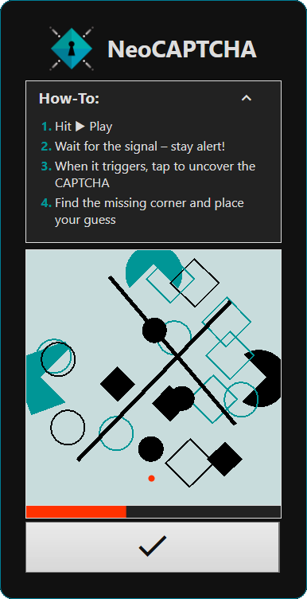

<p align="center">
  
</p>

<h1 align="center">NeoCAPTCHA</h1>
<p align="center"><em>The CAPTCHA the internet deserves.</em></p>

<p align="center">
  <a href="https://neo-captcha.com">Website</a> •
  <a href="#quick-start">Quick Start</a> •
  <a href="#about">About</a> •
  <a href="#license">License</a>
</p>

---

## Why neoCAPTCHA?

- ✅ No tracking, no data collection  
- 🧠 Doesn’t train AI models  
- 🎯 Easy for humans, hard for bots  
- ⚡ Lightweight and easy to integrate  
- 🔐 Hosted backend – privacy-first by design  

## Quick Start

```html
<!-- 1. Add a target element -->
<div id="neo-captcha"></div>

<!-- 2. Include the script -->
<script src="https://neo-captcha.com/widget/v1/neo-captcha.js"></script>

<!-- 3. Render the CAPTCHA -->
<script>
    window.NeoCAPTCHA.renderCaptcha(document.getElementById("neo-captcha"), {
        showHowTo: true,
        expandHowTo: false,
    }, {
        onSuccess: () => {
            console.log("CAPTCHA passed!");
        },
        onFailure: () => {
            console.log("CAPTCHA failed.");
        }
    });
</script>
```

That’s it.
Use the callback methods ```onSuccess``` and ```onFailure``` to grant or deny access to the features you wanna protect from bots.
Configuration options:
```ts
{
    showHowTo: true,       // shows instructions on how to solve the CAPTCHA
    expandHowTo: false,    // expand or collapse the "How-To" section initially
    minDifficulty: 'easy', // ['easy', 'medium', 'hard']
}
```

## Preview

<p align="center">
  
</p>

## About

**NeoCAPTCHA** is a privacy-first CAPTCHA system designed to be intuitive, satisfying, and bot-resistant.

The frontend widget is open source. The backend is hosted and stateless, using signed challenges and human interaction heuristics.

## Roadmap

✅ Interactive widget (click-to-reveal, [Kanizsa](https://en.wikipedia.org/wiki/Illusory_contours)-based challenge)  
✅ Mobile & touch support  
✅ Sound / visual start signal  
⬜ Even more bot-proof but intuitive challenges  
⬜ Customization / branding options  
⬜ Licence API keys for even more security  

## Contribute

Pull requests are welcome!  
Have a feature idea or integration suggestion?  
→ [Open an issue](https://github.com/ginzhio/neo-captcha-frontend/issues)

## License

MIT – see [LICENSE](./LICENSE)

#
# Stay tuned for additional features, customization options and security updates!

---

> Made with focus & no cookies  
> by [@ginzhio](https://github.com/ginzhio)
